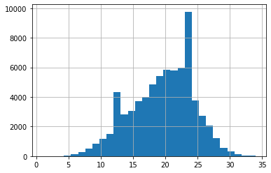

---
title: "DARL Project Status Notebook Template"
author: "Thomas Shweh"
date: "06 November 2020"
output:
  html_document:
    toc: yes
  pdf_document:
    toc: yes
subtitle: "Covid Twitter"
---

## Weekly Work Summary	

* RCS ID: shweht
* Project Name: Covid Twitter
  * Moday - Wednesday (10/26-10/28)
    * Make tweaks on reply tweet ingestion script based off of Abraham's feedback
    * Make scrolling script more configurable, fix calls to elasticsearch bulk api, cleanup elasticsearch indexes after using them
  * Friday (10/30)
    * Integrate Dropbox API for retrieving dataset from a remote enviornment in a notebook
  * Weekend (10/31 - 11/1)
    * Investigate SemEval dataset and what each data file looks like, what columns included and what data do I need for the pipeline
  * Monday-Tuesday (11/02 - 11/03)
    * Parse all data from SemEval dataset into TweetId, Sentiment and Text columns
    * Split all data into training testing and validation sets
    * Cleanup and standardize all data from SemEval dataset for analysis
    * Encode all tweets as BERT tokens to be loaded into tensors for a neural network framework
  * Wednesday (11/04)
    * Present progress on current sentiment classification pipeline
    * Look into articles and direction provided by Abraham on how to finetune a BERT model
    
* Summary of github commits
    * https://github.com/TheRensselaerIDEA/COVID-Twitter/pull/42/commits/cc767d27bdce842f7ab3f0d7577fd6ec43eccc8f
      This commit moves all the configurable parameters such as elasticsearch host, index, port into a configuration file.
      All data relative to the elasticsearch client is ofloaded to a seperate config file
    
    * https://github.com/TheRensselaerIDEA/COVID-Twitter/pull/42/commits/a519ba844a76287805216fd91a0e7d884992e631
      This commit clears the scrolling index after the script is run to save memory
      It also fixes uses of the elasticsearch bulk api

    * https://github.com/TheRensselaerIDEA/COVID-Twitter/commit/a6613ca51d2af53f774283f87a3ec385ef8c1052
      You may have trouble viewing a raw jupyter notebook. A direct view can found here
      https://github.com/TheRensselaerIDEA/COVID-Twitter/blob/bert_sentiment/sentiment/BERT_sentiment.ipynb
      This commit starts the sentiment classification pipeline using BERT. This commit includes the following
      1. Downloads SemEval dataset from dropbox
      2. Reads all datafiles and parses tweets into a pandas dataframe
      3. Amalgamates all data and splits data into training, testing and validation sets
      4. Tokenizes tweet text using BERT Tokenizer
      

* List of references (if necessary)

    * https://arxiv.org/pdf/2005.07503.pdf Paper on a BERT model trained on tweets during the start of the coronavirus pandemic
    * https://arxiv.org/pdf/1704.06125v1.pdf Paper on evaluating sentiment of tweets using CNNs on SemEval dataset
    * https://huggingface.co/transformers/custom_datasets.html How to finetune BERT models in PyTorch
    * https://medium.com/@aniruddha.choudhury94/part-2-bert-fine-tuning-tutorial-with-pytorch-for-text-classification-on-the-corpus-of-linguistic-18057ce330e1
      Example of training BERT for a classification problem
    * https://www.dropbox.com/s/byzr8yoda6bua1b/2017_English_final.zip SemEval dataset
      
* Indicate any use of group shared code base

    * I created https://github.com/TheRensselaerIDEA/COVID-Twitter/blob/bert_sentiment/sentiment/BERT_sentiment.ipynb
    * I modified all files in https://github.com/TheRensselaerIDEA/COVID-Twitter/twitter-api/tools/twitter-api/
    
* Indicate which parts of your described work were done by you or as part of joint efforts

    * https://github.com/TheRensselaerIDEA/COVID-Twitter/pull/42 
    * https://github.com/TheRensselaerIDEA/COVID-Twitter/pull/44
    These two pull requests are worked on by my own. I have had advice from Abraham but the code is all my effort.

## Personal Contribution	

* I made the revisions to the reply tweet script based on Abraham's feedback
* This includes cleaning up elasticsearch scrolling indexes and making the script more configurable
* This week I focused on preparing the data for setniment classification and creating this pipeline in jupyter notebooks
* This includes the process of downloading the data from a source, parsing out the data into usable column vectors, cleaning up any miscelaneous or unusable data, and Tokenizing the tweet strings using BERT
* I then reasearched into the process of finetuning a BERT model and working with a model trained on a corpus of tweets during the start of Covid

## Discussion of Primary Findings 	

* Discuss primary findings:

1. The following has to do with exploring the SemEval twitter dataset and evaluating it's usefulness for training a BERT model for sentiment classification. The original SemEval competition was meant for teams to compete in most accurately classifify tweets in 5 distinct subtasks.
  1. General classification of positive, negative neutral for tweets
  2. Classification of tweets as positive or negative based on a topic
  3. Classification of tweets on a scale from -2 (most negative) to 2 (most positive) based on topic
  4. Prediction on a distribution of positive or negative tweets
  5. Prediction on a distribution of tweets on a scale from -2 to 2.
These subtasks each come with their own individual training, dev, and testing sets for each class. However, for what we want to build, which is a general purpose tweet sentiment classification, I am choosing to forgo the labels on the data files. That means I will choose to view all tweets and their classfications holistcally and I will aggregate all the tweets ad their classification. While these labels may help us in the future if we to predict specific types of tweets based on topic, I think getting a wide corpus of tweets to train on is our first priority. In order to so I will need to read all the data and import it in a common data format. Some issues that arose where the different scales that the sentiments were measured on. To remedy this, I normalized the data for files that classified tweets on a 5 point scale from -2 to 2. Hence in our final dataset we have tweets that are either -1 (negative), 0 (neutral), 1 (positive).
A final sampling of data shows this summary
```{r}
table <- data.frame(
  sentiment = c("neutral", "negative", "positive"),
  count = c(15550, 37128, 48796)
)
table
```
Here is a distribution of the word lengths of the tweets in this dataset.



We can see that the tweets average between 20 to 25 words in length and follow a normal distribution.

Another potential issue with this type of data is that the data is categorial while VADER sentiment is numerical. VADER sentiment computes a sweep through a string and computes and aggregate score of all the words used in the sentence. Meanwhile BERT will be giving us a response that is in one of 3 categories. That is our BERT classifier will only be able to give one of three responses of how to classify a tweet without knowing its "score". The best we can do in this case is to provide the classfication and the confidence level for each of the categories that BERT has classified a tweet for. In order to compare the two models, I will need to create bounds for a VADER score to adjust that nunmerical data into categorical based on a range. Then I will be able to more accurately compare the models.

The last step in my tweet data processing pipeline is the tokenizing of each tweet using an existing BERT model. This is done to get the intermediate representation that BERT understands language. Instead of taking in a list of words or lexicons, BERT takes in the whole sentence at once as it's input. In order to fine tune BERT with our SemEval dataset, we will need to transform the tweets in our dataset in to a form that BERT can understand. Note this preprossing step uses an existing BERT model to transform the sentences into it's representation of words. This tokenization step was done on a model CT-BERT which is pretrained on a corpus of tweets so the tokenized version of our tweets will be tokenized in the context of a tweet.

Below is a visualization of what a tokenized tweet looks like
```
Base:
dear @Microsoft the newOoffice for Mac is great and all, but no Lync update? C'mon.
Tokenized:
{'input_ids': [[101, 1040, 102], [101, 1041, 102], [101, 1037, 102], [101, 1054, 102], [101, 102, 0], [101, 1030, 102] ... }
```

Citation: https://alt.qcri.org/semeval2017/task4/

## Next Steps

* For the next week I will look deeper into finetuning BERT models for our particular problem
* I will create a neural network that classifies tweets based on their sentiment score the model's performance
* I hope to have this initial proof of concept of tweet sentiment classification pipeline using BERT 
* Create a benchmark for how VADER sentiment works vs BERT using the dataset that I have prepped currently
* Look into other external datasets that are sentiment scored to compare performance
