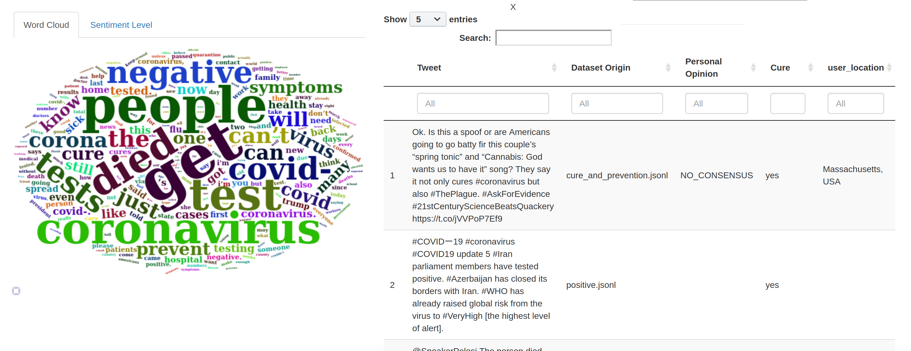
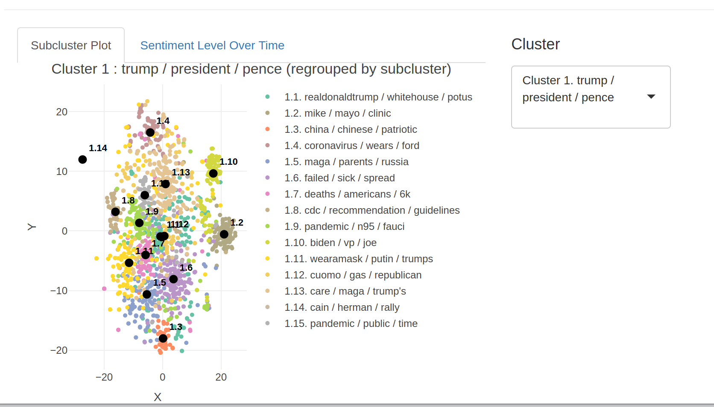
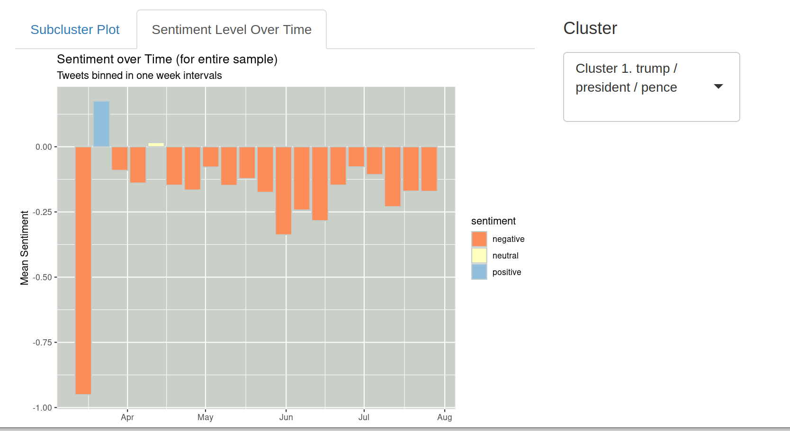

## Weekly Work Summary	

* RCS ID: shweht
* Project Name: Covid Twitter

  * Weekend (09/19-09/20)
    * Investigate R shiny apps in the github repo from past work
    * Get the shiny app that Lauren created last summer to run. Screenshots will be provided later
        * https://github.com/TheRensselaerIDEA/COVID-Twitter/blob/master/analysis/app.R
  * Tuesday (09/22)
    * Explore parameters in the notebook
      * https://pages.github.com/TheRensselaerIDEA/COVID-Twitter/blob/master/analysis/twitter.Rmd
    * Knit the notebook with 100,000 tweets
  * Wednesday (09/23)
    * Discuss with Abraham, Dr. Bennett and Brandon about directions to take this project and what should be included in the Shiny apps
  * Thursday (09/23)
    * Run the other shiny app that Luaren worked on over the summer can be found at
    * https://github.com/TheRensselaerIDEA/COVID-Twitter/blob/master/analysis/twitter_app.R
      
    
* Summary of github commits 

    * No commits were made this week. The work that I have done was mainly trying to get notebooks to knit and shiny apps to run. 
      The modifications that I have made to these files should not be exposed on the internet since they expose the elasticsearch cluster.
    * Don't havet access push branches in the public github repo. But I will release a PR detailing how to use Python on the IDEA cluster
    * You can view my python instructions on my forked repo
    * https://github.com/shwehtom89/COVID-Twitter/blob/master/PYTHON.md

* List of references (if necessary)

    * "Unmasking the conversation on masks: Natural language processing fortopical sentiment analysis of COVID-19 Twitter discourse"
      https://github.com/TheRensselaerIDEA/COVID-Twitter/blob/master/publications/COVID_Twitter_AMIA_2021_Paper.pdf
      
* Indicate any use of group shared code base

    * Modified copies of notebook twitter.Rmd for personal inquiry
    * Created snapshot of analysis pipeline to feed into R shiny app
    * Did not modify but ran app.R and twitter_app.R to analyze progress
    
* Indicate which parts of your described work were done by you or as part of joint efforts

    * Abraham modified twitter_app.R and pushed it to github
    * The other files were already existing on github and I modified them to get them to run (twitter.Rmd, app.R)

## Personal Contribution	

* Outlined the steps to get `twitter.Rmd` to knit for this semester's cohort working on Covid Twitter on Slack
  Specifically, I suggested the elasticsearch parameters and on github do not work for the IDEA cluster. I have sent a message of correct parameters for use on the slack channel.
* Found and ran Luaren's shiny app built over the summer. Had a discussion between Dr. Bennett and Abraham on where to take the shiny app in. From the meeting we found that giving external users the ability to perform their own queries will be too slow and costly on our given hardware. Instead the direction that we think we are heading is providing certain snapshots available for external users to explore. If users want to make their own queries we will provide a instructions and data in a github repo. Potentional for creating a setup script for this
* Discussed with Brandon and Abraham about future direction to take this project. We discussed predicting the future responses to tweets and also the future snetiment of those responses to the tweets. Suggestion of going with training the model in python and using pytorch for this problem.

## Discussion of Primary Findings 	

* Discuss primary findings: 

    * This week I wanted to find out what was accomplished over last summer for the R shiny apps that Lauren built. Below you can find screenshots of the different apps available. 
    ** app.R **
    This shiny app provides a way for users to perform an elastic search query. However from the code, it appears that the parameters are hard coded it at build time. I have attempted to use the search bar but I cannot see any changes. What does work however is that it shows a kmeans cluster along with a word map and specific tweet information.
    
	
	** twitter_app.R**
	This app provides a way for users to view a clustering based off of an elastic search snapshot. It is a visualization that you lets you move through each one of the subclusters and view them individually. This is easier than scrolling through the knitted pdf. 
	
Another visualization that this app gives is the sentiment level over time for tweets in a particular cluster. It can either be positive, negative or neutral. This is graphed over the time intervals of and the sentiment level is graphed on the y-axis

While these visualizations are useful they perform an elastic search query in the background. This may not scale up given the number of users that we have. As such I think we may want to just search snapshots as shown in the other shiny app that just loads a snapshot. I think that hosting snapshots for users to choose from might be a better alternative for our situation. I plan to include different visualizations and have a search functionality to find what cluster the search is most relavent to. If the user wants to perform their own queries we will need to provide a repo and instructions to self host.

## Next Steps

* For the next week I will research how to build R shiny applications and how they work. This will help me build off of the previous work done over the summer and provide useful visualtions
* I will also reasearch language models in order to tackle perdicting response sentiment to a tweet
* Lastly I will familiarize myself with elastic search and be able request tweets and their corresponding replies to gather data for this model
