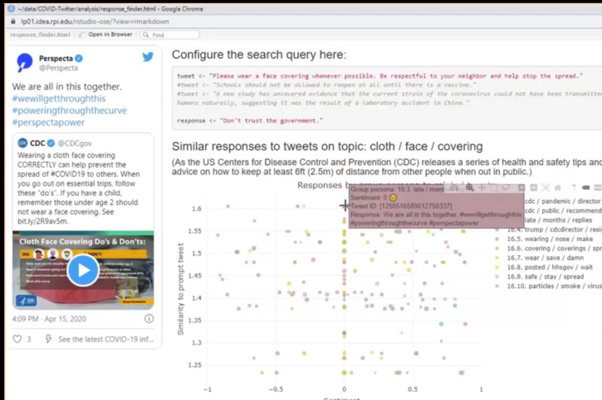
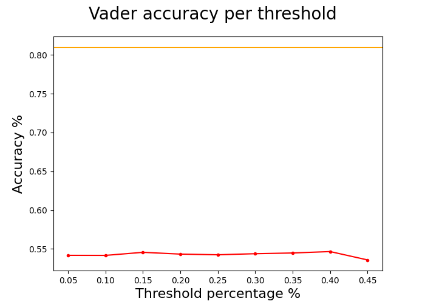
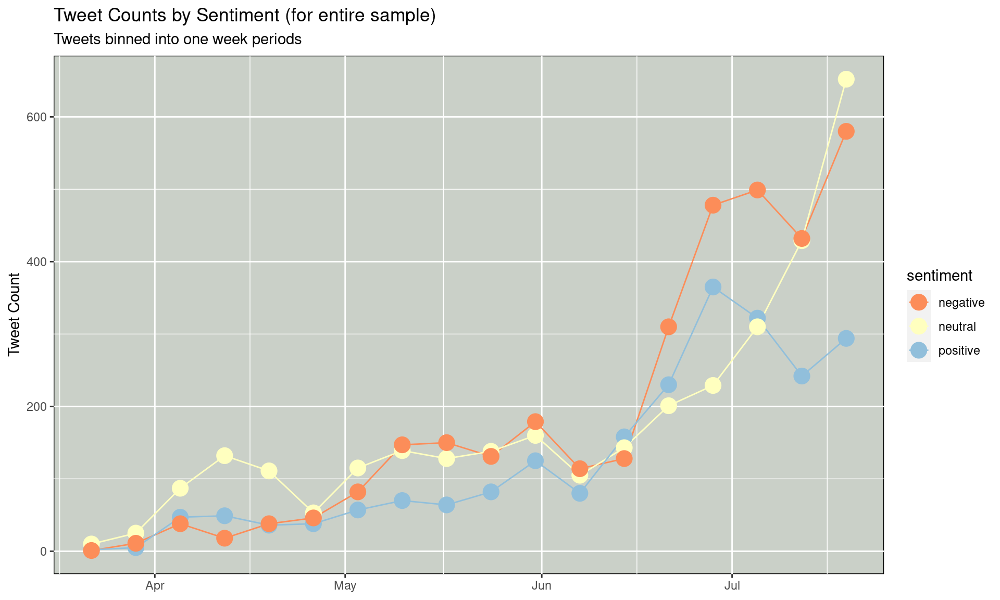
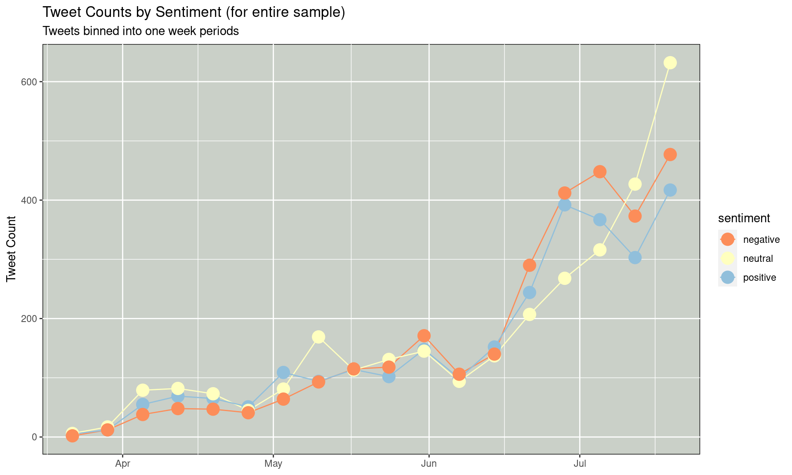
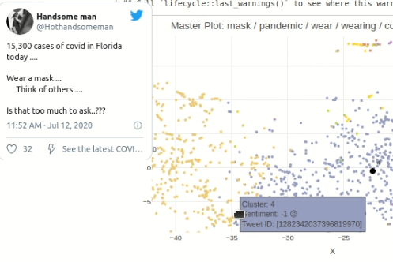
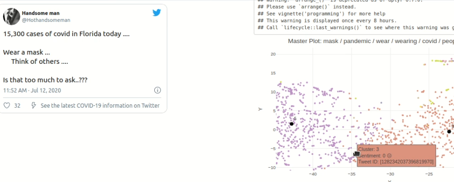
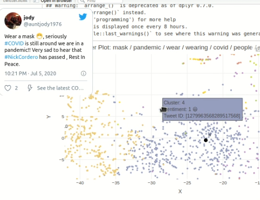
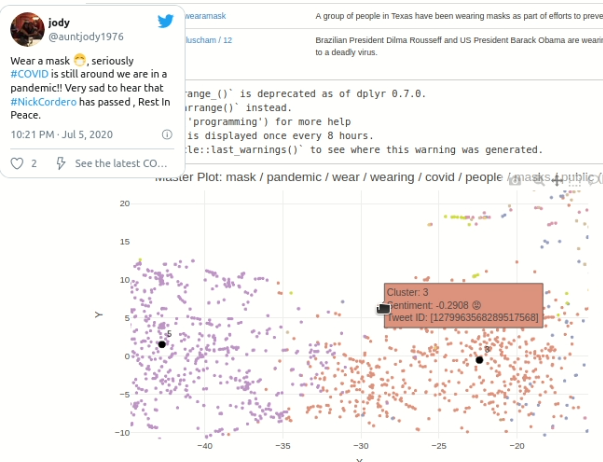
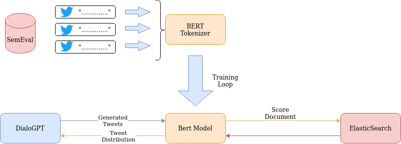

```{r setup, include=FALSE}
# stick libraries here
knitr::opts_chunk$set(echo = TRUE)
library(reticulate)
use_condaenv(condaenv = "bert_sentiment", conda = "/software/anaconda3/condabin/conda")
```


# Final Project: Submission Links

*This should be the first section of your final project notebook. Fill out the following according to how you submitted your notebook!*

* github repository: https://github.com/TheRensselaerIDEA/COVID-Twitter
* Your github ID: shwehtom89
* Github branch name of your submitted notebook: darl-shweht-final-notebook
* link to knitted, merged notebook (post to LMS!): 
    + https://htmlpreview.github.io/?https://github.com/TheRensselaerIDEA/COVID-Twitter/blob/darl-shweht-07Dec2020/DARL-2020-Notebooks/darl_shweht_07Dec2020.html

# Overview & Problems Tackled

Every message posted by public leaders is subject to a wide range of public discourse and opinion. In times of a pandemic, the messages of leaders, posted in avenues with near instant feed like Twitter can have immediate effects on the public and generate unknown reactions. As such, a tool that could generate a response distribution and predict public preception to issues to a message or theme might be in the interest of leaders and official organizations. Just as the Covid Twitter project previously studied discourse themes and topics related to mask-wearing, this project aims to move in the direction of generating a distribution of responses and their perception to a single message. [1]

This is where Sentiment comes into the picture. In order to generate how the public will respond to a Tweet, a distribution of responses will be generated using DialoGPT and each of these responses will be scored on based on their sentiment. The aggregate of these scores will represent how the public Twittersphere will respond to a Tweet. Currently the COVID Twitter analysis pipeline uses VADER Sentiment analysis in order to generate a sentiment score for a particular tweet. While VADER sentiment provided a baseline to evaluate sentiment, it has it's shortcoming when evaluating the sentiment of Tweets. [2] VADER is based on a pre-scored and lexicon and sentiment is calculated by taking an aggregate of these scores. The limitations come from when the model encounters words outside its lexicon and nuance phrases within tweets which produce mixed results from the model. A prime example can be found below.

In this example we can see that VADER does not know how to interpret this Tweet and gives it a neutral score. However, we can see that VADER cannot interpret the hashtag #wewillgetthroughthis which is seen as a positive message.

Hence, the central question if this notebook arises. Can we create a classification model that can classify Tweet sentiment that is more robus contextually aware?

Enter BERT, a deep learning language model released by Google in 2018 that can be finetuned to solve a variety of Natural Language Processing tasks. The main difference with BERT lies in its encoding mechanism and its transformer architecture. Traditioanlly, language models are interpreted in one direction, whereas in BERT, the whole "sentence" itself is encoded which leads to a more contextually aware language model. Another benefit of using BERT is its architecture. The base model is pretrained on a large corpus of text which alleviates the need of expensive computaion to train a model to solve a different model. Hence, we can finetune the base model to solve a classification problem of scoring Tweet Sentiment. This notebook will explore training a BERT Model to classify Tweet Sentiment. Specifically CT-BERT will be used as it is trained on a corpus of Tweets during the coronavirus pandemic

# Contributions
Below are a list of my PRs and commits throughout the semester and a brief description of each

1. https://github.com/TheRensselaerIDEA/COVID-Twitter/pull/40 In this PR I help Brandon with the reply tweet retrieval script. Specifically I interface with elasticsearch to scroll through an index and retrieve the given data

2. https://github.com/TheRensselaerIDEA/COVID-Twitter/pull/42 In this PR I clean up the initial tweet reply retrieval script and make function calls more configurable and maintainable. Also I fix a minor bugs with scrolling

3. https://github.com/TheRensselaerIDEA/COVID-Twitter/pull/46/ In this PR I begin the first few steps into creating the BERT model for Sentiment classification. This includes downloading the SemEval dataset from dropbox, parsing and cleaning up the dataset, investigating the dataset and splitting it into train, test and validation sets

4. https://github.com/TheRensselaerIDEA/COVID-Twitter/pull/49 In this PR I finish the second half of the BERT model. Here train the BERT model for 5 epochs for classification. Additionally, I add a validation step to each epoch which evaluates the performance of the model in this state. Lastly, I evaluate the model on the testing set

5. https://github.com/TheRensselaerIDEA/COVID-Twitter/pull/51 In this PR I convert the inital notebook into a runnable python script to be ran on the IDEA cluster. I made a few refactors and modifications to the script to be runnable. Here it was trained for 25 epochs on the cluster

6. https://github.com/TheRensselaerIDEA/COVID-Twitter/pull/52 In this PR I generate results for how well VADER performs on the SemEval dataset. This includes testing a variety of different thresholds and seeing how to squeeze the best performance out of VADER. I additionally plot the results of accuracy per threshold and compare it to BERT on one graph.

7. https://github.com/TheRensselaerIDEA/COVID-Twitter/pull/53 In this PR I create a module for batch classifying tweets. This can be used both in updating our data in elasticsearch and be run as a server to respond to classifications on the fly. I modify the update script to add a bert sentiment score to each document. This was also an engineering effort to significantly improve performance over the existing update logic with the use of batching and functional programming.

# Data Description

In order to train the model, we will need a large dataset of Tweets with labeled sentiment. Fortunately there exists a dataset of labeled Tweets hosted under SemEval. SemEval is a competition in computational linguistics that happened yearly from 2013-2017 for Tweet Sentiment classfication. The dataset can be found on https://www.dropbox.com/s/byzr8yoda6bua1b/2017_English_final.zip
```{python}
import numpy as np
import pandas as pd
import seaborn as sns
import requests
import os.path
from sklearn.model_selection import train_test_split


# download the SemEval dataset that is hosted on dropbox
# if the file exists locally do not download
def downloadDataset(fileurl: str, outpath: str='semeval.zip'):
    # make sure file is in correct format
    if '.zip' not in outpath:
        outpath = f'{outpath}.zip'

    if not os.path.isfile(outpath):
      res = requests.get(fileurl, allow_redirects=True)
      with open(outpath, "wb") as f:
          f.write(res.content)
```
The data varries from year to year so some data cleanup was necessary in order to create a uniform dataset for training. Since the goal of this project is not to solve the subtasks in the SemEval dataset, all the labeled data will be aggregated into one big dataset. Specifically one task had 5 classes of labeled sentiment and that was normalized into 3 different classes so it could be better aligned without our dataset. Below is some parsing needed in order to aggregate the dataset into TweetId, Tweet, Sentiment columns

```{python}
# Create a generator for SemEval Twitter Data
# The data files are separated by tab and each folder has it's own data format
# loops through all folders to look for files with setniment data

def parseTwitter(folders):
  mapping = {'-2': 'negative', '-1': 'negative', '0': 'neutral', '1': 'positive', '2': 'positive'}

  for folder in folders:
    for file in [f'{folder}/{f}' for f in os.listdir(folder) if 'twitter' in f]:
      with open(file, 'r') as f:
        for line in f:
          segments = line.rstrip().split('\t')
          
          # parsing logic for different types of file formats
          if len(segments) < 3:
            continue
          elif 'A' in folder:
            tweet_data = [segments[0], segments[1], ''.join(segments[2:])]
          elif 'B' in folder:
            tweet_data = [segments[0], segments[-2], segments[-1]]
          else:
            tweet_data = [segments[0], mapping[segments[-2]], segments[-1]]
          yield tweet_data

# extract data from zip archive for SemEval Data
# unpacks the zip file and gets folders to extract data from
# returns a dataframe of the tweets and sentiment
def loadData(datapath: str='semeval'):
    # unzip data if folder is not present
    if not os.path.isdir(datapath):
      import zipfile
      with zipfile.ZipFile(f'{datapath}.zip', 'r') as zip_ref:
          zip_ref.extractall(datapath)

    # get all folders with relavent data in them
    task_folders = [f'{datapath}/2017_English_final/GOLD/{folder}'
                    for folder in os.listdir(f'{datapath}/2017_English_final/GOLD') 
                    if os.path.isdir(f'{datapath}/2017_English_final/GOLD/{folder}')
    ]

    # create a pandas dataframe
    return pd.DataFrame(parseTwitter(task_folders), columns=['TweetId', 'Sentiment', 'Text'])


downloadDataset("https://www.dropbox.com/s/byzr8yoda6bua1b/2017_English_final.zip?dl=1")
df = loadData()
```
Below is the result of out data aggregation. There exists an "off topic" sentiment class. This was discarded since it only was comprised of 3 tweets.
```{python}
sns.heatmap(df.groupby(['Sentiment']).agg('count'), annot=True, fmt=".1f")
```
Here is a preview of of the tweets in this dataset
```{python}
df.head()
```

For this project dataset was split using scikit learn with a constant seed into 70% training, 15% testing, 15% validation sets.
```{python}
# delete categorical data that is not relavent
df = df[df.Sentiment != 'off topic']

# convert categorical data in words to numerical values for callsification
df.Sentiment = pd.Categorical(df.Sentiment)
df.Sentiment = df.Sentiment.map({'negative': 0, 'neutral': 1, 'positive':2})

# split dataset into 70% training, 30% used for testing and validation
train_text, temp_text, train_labels, temp_labels = train_test_split(df['Text'], df['Sentiment'], 
                                                                    random_state=2018, 
                                                                    test_size=0.3, 
                                                                    stratify=df['Sentiment'])

# split temp data evenly, results in 15% testing and 15 % validation
val_text, test_text, val_labels, test_labels = train_test_split(temp_text, temp_labels, 
                                                                random_state=2018, 
                                                                test_size=0.5, 
                                                                stratify=temp_labels)
```

# Results

## Problem 1 

The primary goal of this project was to create a Tweet sentiment classifier model.  Out of the box, BERT is trained on a MLM next sentence prediction problem and we will finetune the model to predict an output of our choosing. In this case, we would wantthe BERT model to output to a 3 class, classification problem. This problem involves finetuning a BERT model in order to predict sentiment as it's output. Currently BERT is trained on a MLM next sentence prediction problem and we will finetune the model
 
### Methods

In order to accomplish this, we finetune a model using the huggingface transformers library (https://github.com/huggingface/transformers). This library provides us with the necessary tools in order to build out this model. Below are the primary steps taken in order to train the model.

1. Encode the SemEval dataset Tweets using the BERT Tokenizer provided by hugginface
```{python, eval=FALSE}
from transformers import AutoTokenizer

# initialize bert tokenizer, this is used to encode tweets into a form
# that bert can understand and use for training / inference
model_name = 'digitalepidemiologylab/covid-twitter-bert-v2'
tokenizer = AutoTokenizer.from_pretrained(model_name)

# set truncation length, this data never exceeds 35 in sequence length
max_seq_len = 35

# used to batch encode the training data into tokens that BERT can use
train_encodings = tokenizer(
    train_text.tolist(),
    return_tensors="pt",
    padding=True,
    truncation=True,
    max_length=max_seq_len,
)

# ......
# the same is done for validation data and testing data
```
2. Get a a model for the Classficiation problem. Huggingface provides an API for generating a neural net with an output layer. Hence, by specificying the number of layers as 3, huggingface will automatically give us a neural network model that outputs 3 different classes.
```{python, eval=FALSE}
from transformers import AutoModelForSequenceClassification

# initialize pytorch model for classifying sentiment
# Huggingface provides and API for constructing a neural net for classification
# Here we are not defining our own neural net
# sets output channels to 3, this is used by the API to construct a nueral net
model = AutoModelForSequenceClassification.from_pretrained(
    "digitalepidemiologylab/covid-twitter-bert-v2",
    num_labels = 3
)
```

3. Main training loop (25 epochs)
   1. Feed the model the training dataset in batches
   2. Backpropogate the loss
   3. Step the optimizer
   4. Evaluate the performance of the model on the validation datasetset

4. Evaluate the model on the test set
```{python, eval=FALSE}
# convert predicted values to their semantic meaning
lookup = {0: 'negative', 1: 'neutral', 2: 'positive'}
hactual = np.array(list(map(lambda x: lookup[int(x)], actual)))
hpred = np.array(list(map(lambda x: lookup[int(x)], predictions)))

# calculate accuracy for testing set 
test_acc = np.sum(hactual == hpred) / len(actual)
print("Accuracy: {0:.2f}".format(test_acc))

# plot confusion matrix
y_actu = pd.Series(hactual, name='Actual')
y_pred = pd.Series(hpred, name='Predicted')
df_confusion = pd.crosstab(y_actu, y_pred)

print(df_confusion)


# plot metrics on the data
from sklearn.metrics import precision_recall_fscore_support as score
precision, recall, fscore, support = score(y_actu, y_pred)

print('precision: {}'.format(precision))
print('recall: {}'.format(recall))
print('fscore: {}'.format(fscore))
print('support: {}'.format(support))
```
See results of this output in the Results Section

### Results

Training Statistics.
```{python}
import pickle

# load in save metrics gathered during the training process
with open('../sentiment/training_data.pickle', 'rb') as f:
  data = pickle.load(f)

# load data into a dataframe and group by epoch
epochs = list(range(1, 26))
data_preproc = pd.DataFrame({
    'epochs': epochs,
    'val_acc': data['accuracy'],
    'train_loss': data['training_loss'],
    'val_loss': data['val_loss']
})

# plots validation accuracy, training loss and validation loss on one graph
sns.lineplot(x='epochs', y='value', hue='variable', 
             data=pd.melt(data_preproc, ['epochs']))
```

Data aggregated during training. Plots accuracy, training loss and validation loss per epoch
```{python, eval=FALSE}
Accuracy: 0.81
Predicted  negative  neutral  positive
Actual
negative       1663      532       137
neutral         433     4075      1062
positive         89      670      6561
precision: [0.7610984  0.77221906 0.84548969]
recall: [0.71312178 0.73159785 0.89631148]
fscore: [0.73632942 0.75135982 0.87015915]
support: [2332 5570 7320]
```

### Discussion

Overall training went fairly well for the 25 epochs as we ended with a trainin accuracy that was around 81% or so. As the graph indicates for validation accuracy, there was a slight hiccup for accuracy for a few epochs but the model improved and then started to stagnate. We can see around epoch 20 that the training loss is beginning to flatline this is a good indication that we should stop training around these epochs. This means that further training will not have significant improvements to the model.

Testing set performance similar to performance on the validation set, which indicates that the model was not overfitted to just performing well on the validation set. On the testing set we can see in our precision, recall and fscore that the model has a bias for scoring well on positive tweets. We can see that the scores for all these metrics are significantly higher for the positive category.

Although the model was successfully created, the improvements per epoch were not as substantial for later training. We had promising initial improvements but the validation accuracy did no improve over 82%. This may be a fault of the neural net that we are training. Perhaps instead of using the generated neural net, we could add a custom one with additional layers and Dropout.

## Problem 2

How are we going to compare and evaluate the performance of VADER and BERT? In other words, this issue revolves around finding a common metric to compare the performance of the two models 

 
### Methods

In order compare the two methods, the testing set was used to comapre the performance of the two models. The testing set was created with the same seed for both models. Since VADER requires that classification to be done by manual thresholding, multiple thresholds were chosen to evaluate performance at different points.

### Results

```{python}
import sys
sys.path.append('../sentiment')
from comparison import runTests, classify
from sklearn.metrics import precision_recall_fscore_support as score
import matplotlib.pyplot as plt

# set which thresholds we will be using to test out VADER
thresholds = [0.05, 0.1, 0.15, 0.2, 0.25, 0.3, 0.35, 0.4, 0.45]
actual = test_labels.to_numpy()
accuracies = []

# for each threshold, evaluate performance on the testing dataset
for threshold in thresholds:
  # use VADER to classify a tweet based on a threshold
  print(f'Threshold: {threshold}')
  predictions = classify(test_text, threshold)

  # calculate accuracy
  test_acc = np.sum(predictions == actual) / len(actual)
  accuracies.append(test_acc)
  print(f'Accuracy: {test_acc:.2f}')

  # plot confusion matrix
  y_actu = pd.Series(actual, name='Actual')
  y_pred = pd.Series(predictions, name='Predicted')
  df_confusion = pd.crosstab(y_actu, y_pred)

  print(df_confusion)

# plot metrics on the data
precision, recall, fscore, support = score(y_actu, y_pred)

print(f'precision: {precision}')
print(f'recall:    {recall}')
print(f'fscore:    {fscore}')
print(f'support:   {support}')
print()
        
# plot the accuracy results
fig = plt.figure()
plt.plot(thresholds, accuracies, 'r.-', label='VADER')
plt.axhline(y=0.81, color='#FFA500', linestyle='-', label='BERT')
fig.suptitle('Vader accuracy per threshold', fontsize=20)
plt.xlabel('Threshold percentage %', fontsize=16)
plt.ylabel('Accuracy %', fontsize=16)
fig.savefig('./shweht_images/graph.png')
```
```{r, echo=FALSE}

```
### Discussion

In this test we can clearly see that BERT outperforms VADER in the SemEval classification test. No matter what threshold we choose for VADER, the accuraccy tops off at 54% while BERT has an 81% accuracy. Hence on the testing set we can conclude that BERT is a much more performant classifier compared to VADER in this context. Hence one of the main goals of creating a model more performant and contextually aware was achieved. One thing that BERT does seemingly better than VADER at is in classifying positive tweets. Based on this dataset we can see that BERT overall does better in both tasks if we look at the confusion matrices for both models.

This is not to say that BERT is strictly better than VADER. As actual performance within our pipeline is hard to quantify.

## Problem 3
How can the BERT model be integrated with the current twitter analysis pipeline? How does moving from VADER to BERT affect the results of our twitter analysis pipeline? 
 
### Methods

There are two sections to tackle problem.

#### Elasticsearch
In order for our notebooks to be able to interface with the new BERT data, the entirety of our data in Elasticsearch has to be updated with a BERT score. This process was bootstrapped off the current VADER scoring script. The elasticsearch query was updated in order to retrieve documents that are missing a (VADER score OR BERT score) AND is not a reply tweet.

Additionally, the results to the query need to be scored in batches in order to be performat. Updating in an interative manner was significantly slower than bulk updating. Thus the existing script was modified heavily to perform patch operations onto the query results as opposed to iterating over every result and transforming the data individualy. This increased the throughput from 33 documents / second to around 200 documents / second which makes it more practical for updating indeces. The index coronavirus-data-masks was updated within 2 and a half hours as opposed to 10 with the previous method.

The update structure is also very relavent to interfacing with our existing notebooks
```{python, eval=FALSE}
# document definition for an update operation on elasticsearch
# the new additions are the bert section which contains more data based on
# bert scoring the tweet
action = {
  "_op_type": "update",
  "_id": hit[1].meta["id"],
  "doc": {
    "sentiment": {
      "vader": {
        "primary": vader.polarity_scores(texts[hit[0]])["compound"]
      },
			"bert" : {
			  "scores": bert_texts[0][hit[0]],
        "class": bert_texts[1][hit[0]],
        "primary": bert_texts[2][hit[0]]
			}
  }
}
```
In the updated index, each document will contain scores, which are the confidence levels  that bert has for each one of the classes, positive, negative neutral. It will have a class which is a semantic representation of the prediction, and prediction is a number -1, 0, 1 to represent the classification. This primary field is critical for inerfacing with our analysis pipeline.

#### Analysis Notebook
In order compare the two methods, we have to standardize the data being used in the pipeline. As such, I used the phrase "Wearing masks in response to Covid pandemic" as it was a broad sematic phrase and will produce the same results from a query from elasticsearch. Since elasticsearch was previously updated with a specific format in mind, we do not have to make that many modifications to the current notebook to perform analysis with BERT. Because of the structure, I was able to change 1 line in the pipeline to use the BERT score instead of VADER
```{r}
sentiment_type <- "bert"
```
There is a difference between categorical and numerical data, but the pipeline converts that Vader score to a sentiment using thresholding and performs it's operations using cateogorical results as a opposed to the VADER score.

### Results

#### BERT distribution of Sentiment over time


#### VADER distribution of Sentiment overtime


#### An Example of Good Bert Performance


#### An Example of Poor VADER Performance


#### An Example of Poor BERT Performance


#### An Example of Good VADER Performance


### Discussion

Overall from the results we can see a few trends in the distribution of sentiment per time. One trend that is aparent in the graph in the results section is that BERT classifies more tweets consitently as negative than positive. This may suggest that BERT is handling those more context dependent cases as discussed in the introduction of this notebook. Sometimes, VADER cannot figure out how to classify a tweet because it lacks the context behind certain texts within tweets. However this is not a direct correlation what this difference means. Overall it seems that BERT classifies more tweets as negative than positive in the graph as the number of positive tweets is almost always below that of negative. Meanwhile in VADER, it appears that the two types of tweets are evenly scored.

What is equally interesting is that the shapes of the two plots are relatively similar. Despite their values being different, the absolute maximas and minimas for each line both follow a similar location. This might imply that the two models are performing rather similarly to each other in terms of classifying tweets. Similar shapes but much different values, which means that there may not be that drastic of an improvement of moving to BERT. More data is definately needed with different datasets and perhaps a deeper dive into BERT's confidence levels.

One good example of BERT can bee seen above where it is able to classify the tweet about covid cases as negative while VADER struggles to do so. VADER most likely does not know how to interpret the phrase "covid cases" and the phrasing in this tweet. Meanwhile this is a prime example of the advantages of using BERT as it shows how it can accurately classify tweets with context behind them.

That being said BERT is not a silver bullet. In the second example we can see BERT classifying a tweet urging about the pandemic and the passing of Nick Cordero as positive while VADER classifies it as negative. This shows the faults of relying on BERT as an end all solution to sentiment classification. This mis classification may not be explainable but is an indication that BERT can also be unreliable. 

Overall, there is no clear answer yet of which model performs better for this task. More tests are needed with different datasets and more examples need to be consulted. If possible it might be ineresting to hand score tweets in this example and see which model performs better. One advantage of to this approach is that BERT has more training data to work with. One disadvantage to this approach is that the results of BERT on these pieces of data is no longer valid because it was trained on what is being evaluated.

# Summary and COVIDTWITTER Recommendations

Overally, we have shown that it is possible to create a contextually aware BERT model in order to classfiy Tweets. The model outperforms VADER in our testing set and in preliminary testing in some instances. 
I would recommend using the BERT model for sentiment analysis as it is an improvement over the alternative VADER. This model should be used for the existing Twitter Analysis pipeline for sentiment scoring. Additionally, the model should be used for sentiment scoring with the distribution of tweets generated by DialoGPT. However, I would recommend improving the model in the following ways.
* Model Improvements
  While the improvement over VADER is a good first step, the BERT model can still be improved upon. 81% accuracy on the testing set may not be enough.
  1. Training Data
     A model is reliant on the training data that it is built on top of. Since the SemEval Dataset was used, the Dataset only contains tweets from the time period 2013-2017 and model only "learns" the tweets within this context. Therefore, the model doesn't understand the context behind Tweets made during the covid time. The model has not learned new terms used during COVID times, for example, the model might not understand how the word "COVID" is used in context. To make improvements to the model, more labeled data can be given to training model with Tweets with COVID relavent terms.
  2. Updating the Neural Network Architecture
     The model uses huggingface transformers to create a classification neural net. This package automatically creates a neural net with a basic architecture. This means that the lasy layer goes from 768 to 3 descriptors. Possible improvemnts would include creating a custom neural net with 2 additional convolutional layers and with dropout at each layer.
  3. Pretraining the parameters
     One possible improvement would be to pretrain BERT's parameters beforing training on the training set.
  4. Using a different base model
     CT-BERT has produced a good baselien for prediction accuracy. Other models could be explored for improved accuracy (RoBERTa, XLM, ect...)

# References

* https://arxiv.org/pdf/2005.07503.pdf Paper on a BERT model trained on tweets during the start of the coronavirus pandemic
* https://arxiv.org/pdf/1704.06125v1.pdf Paper on evaluating sentiment of tweets using CNNs on SemEval dataset
* https://huggingface.co/transformers/custom_datasets.html How to finetune BERT models in PyTorch
* https://medium.com/@aniruddha.choudhury94/part-2-bert-fine-tuning-tutorial-with-pytorch-for-text-classification-on-the-corpus-of-linguistic-18057ce330e1
  Example of training BERT for a classification problem
* https://www.dropbox.com/s/byzr8yoda6bua1b/2017_English_final.zip SemEval dataset
* https://curiousily.com/posts/sentiment-analysis-with-bert-and-hugging-face-using-pytorch-and-python/ Blogpost on how to fine tune BERT to predict for a specific language problem
* https://huggingface.co/transformers/custom_datasets.html How to finetune BERT models in PyTorch
* https://mccormickml.com/2019/07/22/BERT-fine-tuning/ Example of how to construct a training loop for Bert
* https://www.dropbox.com/s/byzr8yoda6bua1b/2017_English_final.zip SemEval dataset
* https://github.com/cjhutto/vaderSentiment Vader Sentiment

# Appendix

#### One off Example of how BERT and VADER differ in scoring a sentence


#### Systems diagram of how BERT fits into the project


