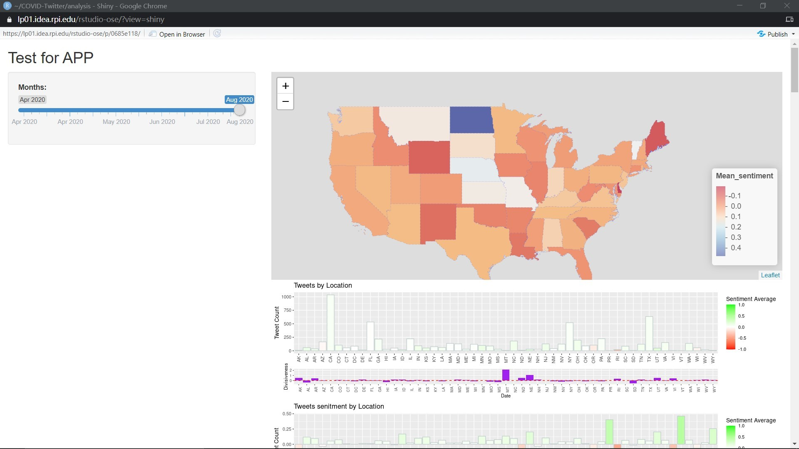

# Final Project: Submission Links 
* github repository: https://github.com/TheRensselaerIDEA/COVID-Twitter/tree/darl-zhangh20
* github ID: jasonht233
* github branch name: darl-zhangh20
* link to this notebook: https://htmlpreview.github.io/?https://raw.githubusercontent.com/TheRensselaerIDEA/COVID-Twitter/darl-zhangh20/DARL-2020-Notebooks/darl_zhangh20_07Dec2020.html
* Shiny App links: http://lp01.idea.rpi.edu/shiny/zhangh20/COVID_Twitter_GUI/ [Right now, it doesn't work very well, I am still working on that]
    
# Overview & Prroblems Tackled: 
* The general work I have done is related to data analysis and shiny app building of the covid-tweet. 
* For the data analysis, I am working on using geographic map to see how different people in different states reacting toward the covid-19 and go to check how people in different states react to public health tweets. 
* For the Shiny app, I am fulfilling the requirement of the Shiny app which will implement the work of twitter.Rmd and twitter_quoted.Rmd. 
* Besides that, I have worked on analysis the top similar tweet, and the reaction of people toward the tweets. 

# Data Description: 
* My general data sets come from the Elastic-search.There are two main index
* The first one is about the tweets related to mask
* The second one is about the retweets/the replied tweets towards the public health organization tweets. 
* Meanwhile, it also related my dataset towards the state data. 

# Results: 

## Problem 1: The geographic analysis of tweets. 
How to implement of the geographic map about the tweets. 

### Methods: 
First of all, we need to think about what kind of summary we want to get? The mean sentiment of the tweets? The total number of tweets? After I think it is meaningful to see the different summary. Hence I am using the geographic map to summarise the mean sentiment over time and the number of positive, negative and neutral tweets in total. 

```
geographical_sentiment_maps <- function(summary.tibble,states, Map.numPercent) {
  ###################################################################################################################
  # Create map and merge the state and state's mean senitment. 
  ###################################################################################################################
  colors <- c("#253494","#4575B4", "#74ADD1","#ABD9E9","#f7f7f7","#FDAE61","#F46D43", "#D73027", "#BD0026")
  title.value = sprintf("mean sentiment (%d %% of sample", Map.numPercent  )
  ###Merge the state 
  states_merged_sb <- geo_join(states, summary.tibble, "STUSPS", "location")
  pal <- colorNumeric(rev(colors), domain=states_merged_sb$mean_sentiment)
  states_merged_sb <- subset(states_merged_sb, !is.na(mean_sentiment))
  ###Add the pop up count
  popup_sb <- paste0("Mean Sentiment: ", as.character(states_merged_sb$mean_sentiment),"<br />Count: ",as.character(states_merged_sb$count))
  
  ###Create the leaflet map 
  leaflet() %>%
    setView(-98.483330, 38.712046, zoom = 4) %>% 
    addPolygons(data = states_merged_sb , 
                fillColor = ~pal(states_merged_sb$mean_sentiment), 
                fillOpacity = 0.7, 
                weight = 0.2, 
                smoothFactor = 0.2, 
                popup = ~popup_sb,
                dashArray = "3",
                layerId = states_merged_sb$STUSPS,
                highlight = highlightOptions(weight=5,color="#666",dashArray="",fillOpacity = 0.7, bringToFront = TRUE)) %>%
    addLegend(pal = pal, 
              values = states_merged_sb$mean_sentiment, 
              position = "bottomright", 
              title = title.value)
}
```
It is parts of codes for me to implement the maps 


### Results:



For the first picture(The number of positive tweets over united states) As you can seen, that people in CA,FL,TX,NY are eager to reply to the COVID-19 tweets (from the public health). In my opinion, it may related to the influence of COVID-19 on them since a lot of people caught COVID in these states. 

For the second pciture(The mean sentiment over united states), you can see that the general sentiment is negative towards COVID in August.

### Discussion: 

During the experiemnt, since it is randomly picked. Sometimes, we cannot find alot of tweets which have a specific states or location. Which may cause the otuput map / graph very different. However, you can see the general trend toward the COVID (people are negative toward the COVID)

## Problem 2: Top Similar Tweets and their replies. 
What if officer want to check the replies or attitudes towards the specfic tweets they may input? 

### Methods: 
Since the elastic Search will return the tweets based on the cosine similarity of the input. So the first one is the most similar tweet by calculation. Hence we only need to see the replies toward the tweets. We can get the overall replies towards that. 
```
##################################################################
# Examples of data cleaning and organizing
##################################################################
renamed.quoted.vectors.df <- quoted.vectors.df
OldColName <- colnames(quoted.vectors.df)
NewColName <- lapply(OldColName, function(x) paste0(x,"_reply"))
colnames(renamed.quoted.vectors.df) <- NewColName
# Combine the replies tweet and the origional tweets 
total.vectors.df <- bind_cols(tweet.vectors.df , renamed.quoted.vectors.df)
total.vectors.df$vector_type<-"tweet"
#Clean the total.vectors.df 
# replies.vectors.df <- total.vectors.df%>%group_by(full_text_reply)%>%do(data.frame(.$id_str))
# Top Similar tweet
top_similar_tweet <- total.vectors.df[1,]$full_text_reply
replies.one.df <- total.vectors.df[(total.vectors.df$full_text_reply == top_similar_tweet),]
```
It is just the small demo of codes that how I find the most similar tweets. 

### Results:


* The first picture is about the count of different sentiment toward the tweet "Closing schools in one way to slow the spread of ... " We are the clear opposite attitude toward the sentiment. 
* The second picture is about the change of the general public. At first, people may feel more negative but later people are optimistic toward the tweets. 

### Discussion: 

* We can see that when we see the top similar tweets. We may not have a very meaningful analysis or conclusion. You can see that people are more opposite. 


## Problem 3: designing the Shiny App.
* How to let more users to implement or check our study? 

### Methods:  

* The shiny app is a very meaningful and useful technology for the developer to develop a app related to method. The codes are not suitable for the app.Hence here is the link towards my app. https://github.com/TheRensselaerIDEA/COVID-Twitter/blob/darl-zhangh20/analysis/app.R [it may not work right now]

### Results:


* Getting Started: 

  * It is the GUI interface when user start the graph is here. 


### Discussion: 


* For the tweets and replies
  * We can see that poeple are not very positive in general vaccine in August. Meanwhile, the attitue or the passion to replies for vaccine is very small. Meanwhile people focus more on "there is no cure". The tweet counts for "no cure" are more than "have vaccine". 
  * Meanwhile, people in different states replies to "we will have vaccine" are different. However, more people having replies more neutral sentiment they are having.
  * Meanwhile, we have very interesting trend that in August people are having a peak to replies to the official tweets 


# Summary: 

As we can see that, toward a new virus, the different changes over state, and over time are significant. Through different statistic measure of the different sentiment, we are able to see how people/public react towards COVID. It may also related to how people react to different strange/dangerous things. 


# References: 
https://github.com/TheRensselaerIDEA/COVID-Twitter/blob/master/analysis/twitter.Rmd
https://github.com/TheRensselaerIDEA/COVID-Twitter/blob/master/analysis/twitter_quotes.Rmd